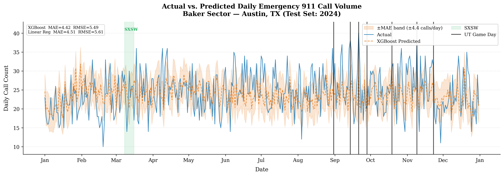
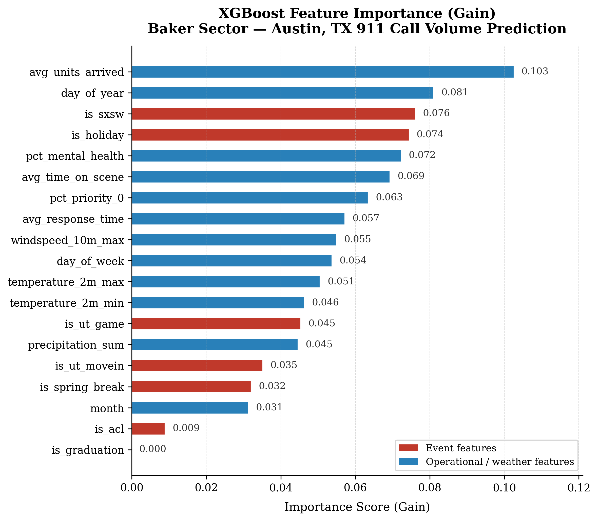

# Austin Emergency Services: Predicting 911 Call Surges Before They Happen

## What happens when fun events go wrong and emergency resource allocation becomes critical for safety?
You already know that SXSW causes traffic, crowds, and more root causes of emergencies. You know what a UT home game on a hot Saturday afternoon looks like by the end of your shift. Can you get ahead of the 911 calls that come with events like these before your shift starts instead of when situations are already heightened? Would you like to be prepared at the start of the day for a surge of 911 calls in order to more efficiently allocate emergency resources for the city of Austin?

## The Problem
Right now, there is no reliable system that tells you tomorrow is going to be a heavy day in Baker before you finalize your staffing. You rely on experience, the event calendar on your wall, and your gut. That works most of the time. But when a UT game, a heat advisory, and a Saturday night overlap in the same shift, gut instinct is not enough, and when your units are spread too thin, response times go up. Especially in Priority 0 situations. 

## The Solution 
This tool uses three years of Baker sector 911 call history, daily Austin weather data, and the full local event calendar such as: football games, SXSW, ACL, move-in weekend, graduation, spring break, and holidays. Using these dates, we predict how many Priority 0 and Priority 1 calls your sector will see on any given day. You put in the date, it tells you whether to bring in extra units or whether it looks like a routine shift. 

The chart below shows predicted vs. actual daily call volume across all of 2024 in Baker sector. On most days the model's prediction tracks closely with what actually came in. The shaded band represents the typical margin of error — about 4 to 5 calls per day. Green shading marks SXSW and purple lines mark UT home game days, the two biggest drivers of elevated call volume our solution identified. 

Here are the rankings of contributing factors to call volume: 

